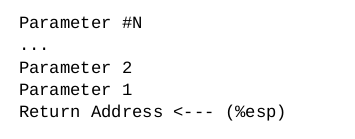
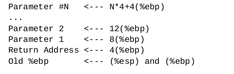
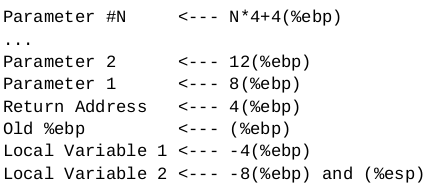
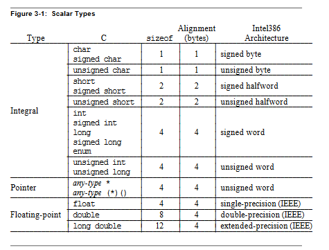
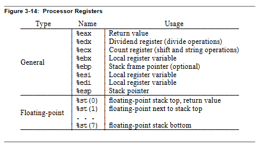
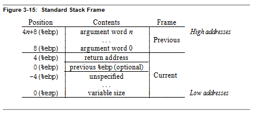
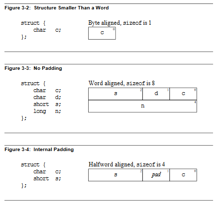
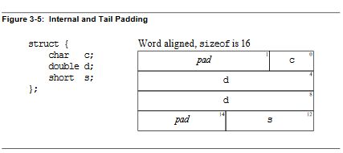

# Funkcje

Na podstawie "Programming From Ground Up"

Wywołanie `call`:

1. Wrzuca na stos tzw. `return address` (adres następnej instrukcji po wykonaniu funkcji)
2. Modyfikuje `%eip` żeby wskazywało na adres początku funkcji

Zakładając, że program przekazuje funkcji jakieś parametry, stos wygląda tak:



Następnie funkcja musi zrobić kopię %ebp:

```
push %ebp
```

I ustalić adres bazowy stosu na jego szczyt:

```
mov %esp, %ebp
```

W ten sposób będziemy mogli odowłać sie do parametrów (bo będą miały stałą pozycję relatywnie do %ebp)

Teraz stos wygląda tak:



Jeżeli chcemy używać zmiennych lokalnych, należy zarezerwować dla nich pamięć:

```
subl $8, %esp
```

Zmienjszamy wskaźnik stosu o 8 bajtów (czyli zwiększamy stos o 2 'słowa')

Pozwala to na używanie `push` i `pop` w dalszej części programu bez obawy, że nadpiszą zmienne lokalne.



Po zakończeniu wywoływania funkcji, przywracamy `%ebp` to poprzedniej pozycji. Zmienne lokalne nie ulegną usunięciu, ale w każdej chwili mogą zostać nadpisane przez wywołanie `push`.

```
movl %ebp, %esp
popl %ebp
ret
```

Zwracana wartość znajdzie się w `%eax`.

# Procedure calls

[źródło](http://www.zak.ict.pwr.wroc.pl/materials/architektura/laboratorium%20AK2/Dokumentacja/Intel%20Penium%20IV/IA-32%20Intel%20Architecture%20Software%20Developers%20Manual%20vol.%201%20-%20Basic%20Architecture.pdf)

## Stos

Blok danych zawarty w segmencie (?) identifikowany przez rejestr `SS`. Stos może mieć wielkość max. 4GB (masksymalna wielkość segmentu).

Wrzucając wartść na stos, _zmniejszamy_ rejestr ESP. Stos "rośnie w dół".

Inicjalizacja stosu:

1.  Establish a stack segment.
2.  Load the segment selector for the stack segment into the SS register using a MOV, POP, orLSS instruction.
3.  Load the stack pointer for the stack into the ESP register using a MOV, POP, or LSSinstruction. (The LSS instruction can be used to load the SS and ESP registers in oneoperation.)

## Near CALL

Komenda CALL przenosi wywoływanie programu w ramach aktualnego segmentu. Umożliwia dostęp do procedur wewnątrz obecnie działającego progamu lub zadania (task).

- Przenosi zawartość EIP na stos
- Loads the offset of the called procedure in the EIP register (?)
- Rozpoczyna wywoływanie procedury

## Near RET

- Przenosi (pop) szczyt stosu do EIP
- Jeśli instrukcja RET ma opcjonalny argument `n`, zwiększa wskaźnik stosu o ilość `n` (?) bajtów. (stos zwiększa się od największej do najemiejszej wartości, czyli usuwamy dane ze stosu)
- Wznawia wykonywanie procedury (która wywołała CALL?)

## Far CALL

Wywoływanie funkcji z innych segmentów kodu (takich jak procedury systemu operacyjnego).

- Rejestr CS wchodzi na stos, potem EIP
- Loads the segment selector of the segment that contains the called procedure in the CS register (?)
- offset wywoływanej procedury zapisany do EIP
- wywołuje żądaną procedurę

## Far RET

- top-of-stack -> EIP
- top-of-stack -> CS
- zwiększa wskaźnik stosu o `n` (jeśli podane)
- Wznawia wykonywanie procedury

## Przekazywanie parametrów

- Poprzez rejestry (przez co można przesłać do 6 paramterów) (ESP i EBP nie mogą być do tego użyte). Wywołana procedura może też w ten sposób przekazać wyniki.
- Dużą liczbę parametrów można przekazać poprzez stos. Here, it is useful to use the stack-framebase pointer (in the EBP register) to make a frame boundary for easy access to the parameters.
- Przekazanie adresu w pamięci

## Zapisywanie stanu procedury przed wywoływaniem CALL

`PUSHA` zapisuje `general-purpose registers` na stos w kolejności `EAX, ECX, EDX, EBX, ESP, EBP, ESI, and EDI`.

`POPA` przywraca zapisane wartości.

`PUSHF(lower word)/PUSHFD(entire register), POPF/POPFD` mogą być użyte dla rejestru `EFLAGS`.

# Function Calling Sequence

[źródło](http://www.zak.ict.pwr.wroc.pl/materials/architektura/laboratorium%20AK2/Dokumentacja/Application%20Binary%20Interface/System%20V%20Application%20Binary%20Interface%20Intel386%20Architecture%20Processor%20Supplement%20Fourth%20Edition.pdf#page=35&zoom=auto,-17,726)





Oprócz rejestrów, każda funckja posiada ramkę obecnego stosu. Wartość stosu "rośnie w dół" zaczynając od tzw. "High addresses".







- "Stack is word aligned". "Word' to 2 bajty.
- Argumenty funkcji C znajdują sie na stosie w odwrotnej kolejności. Argument znajdujący się po prawej stronie w kodzie języka C będzie miał najwyższy adres. Wszystkie przychodzące argumenty (?) znajdują się na stosie (caller - jednostki wywołującej funkcję).
- Wielkość arguemntu jest zwiększana jeśli to konieczne, aby jego wielkość była wielokrotnością słowa (word, 2 bajty).

Wszystkie rejestry są globalne oraz widoczne dla funkcji wywołującej i wywołanej.

`%ebp, %ebx, %edi, %esi i %esp` należą do wywołującej funckji (wywoływana funkcja musi zachować (?) te rejestry dla swojego [caller]). Pozostałe rejestry należą do funkcji wywoływanej (called func). Jeżeli caller chce zachować wartości takich rejestrów, musi je zachować na stosie.

Rejestry (str 38):

- `%esp` - stack pointer. Zachowuje pozycję ramki stosu. Adres słowa na szczycie stosu.
- `%ebp` - frame pointer. Adres bazowy ramki stosu. Funkcja dostaje nową ramkę (?) która leży tuż za stosem callera. Aby uzyskać argument funkcji, należy dodać pewną wartość do %ebp (uzyskamy w ten sposób dane tuż za ramką funkcji). Odejmując wartości, uzyskamy dostęp do lokalnychzmiennych funkcji.
- `%eax` - funkcja zwracająca `struct` albo `union` umieszcza ich adres w eax. Otherwise this is a scratch register (?).
- `%ebx` - As described below, this register serves as theglobal offset tablebase registerfor position-independent code. For absolute code,% e b xserves as a local register and has no specified role in thefunction calling sequence. In either case, a function mustpreserve the register value for the caller. (?)

[...]
