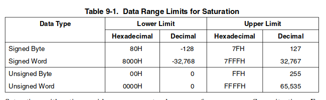

> The extensions introduced inthe MMX technology support a single-instruction, multiple-data (SIMD) execution model thatis designed to accelerate the performance of advanced media and communications applications.

The MMX technology provides three ways of handling out-of-range conditions:

- Wraparound arithmetic (niemieszczące się najstarsze bity są ignorowane)
- Signed saturation arithmetic (wynik zatrzymuje się na największej (lub najmniejszej) możliwej wartości, w granicach wartości danych ze znakiem)
- Unsigned saturation arithmetic (wynik zatrzymuje się na największej (lub najmniejszej) możliwej wartości, w granicach wartości danych bez znaku)

[INTEL IA-32 MMX INSTRUCTION SET SUMMARY](http://www.zak.ict.pwr.wroc.pl/materials/architektura/laboratorium%20AK2/Dokumentacja/Intel%20Penium%20IV/IA-32%20Intel%20Architecture%20Software%20Developers%20Manual%20vol.%201%20-%20Basic%20Architecture.pdf#page=235&zoom=auto,-27,605)

Wywołanie instrukcji MMX powoduje utratę danych w jednostce zmiennoprzecinkowej (x87 FPU). W przypadku mieszania instrukcji FPU i MMX zaleca się:

- FPU -> MMX: zapisać stan rejestrów FPU (instrukcje `FSAVE`, `FXSAVE`)
- MMX -> FPU: `FSAVE`, `FXSAVE` także zadziała. Ponadto zaleca się wywołanie `EMMS` (empty mmx state)

## Konstrukcja komend:

sufiksy:

    Byte (8 bits)
    Word (16 bits)
    Double word (32 bits)
    Quad word (64 bits)
    US (unsigned)
    S (signed)

PSUBUSB subtracts unsigned bytes, while PSUBSD subtracts signed double words
