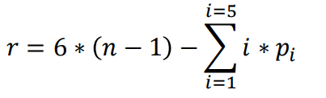

# Podstawy Automatyki i Robotyki W04
notatki na podstawie przykładowego testu zaliczeniowego

---

## Sterowanie predykcyjne
W sterowaniu predykcyjnym regulator dostosowuje swoje działanie z wyprzedzeniem, zanim nastąpią zmiany wielkości wyjściowych układu [[link]](https://pl.wikipedia.org/wiki/Sterowanie_predykcyjne)

## Predyktor horyzontu

?

## Regulatory PID
Ich celem jest utrzymanie wartości wyjściowej na określonym poziomie, zwanym wartością zadaną. [[link]](https://pl.wikipedia.org/wiki/Regulator_PID)

Przykład: chcemy żeby silnik miał stałe obroty, mimo stale zmieniających się czynników zewnętrznych (np. jego obciążenia). Regulator co chwilę sprawdza uchyb od pożądanej wartości, dostosowuje wartości mające wpływ na obroty silnika tak, żeby szybkość obrotów wróciła do normy.

Wejście regulatora: uchyb (wartość zadane - aktualna wartość)

Wyjście: sygnał sterujący silnikiem

Algorytm obliczeń regulatora PID zawiera trzy oddzielne stałe parametry i dlatego czasami bywa nazywany regulatorem z trzema członami: proporcjonalnym, całkującym i różniczkującym, oznaczonymi odpowiednio P, I i D.

* P - zwiększa jakąś wartość przez wartość błędu. Nie wpływa na redukcję błędu.
* I - dostosowuje wyjście do danych z przeszłości. Wypływa na kocową wartość jeśli dotychczasowe wartości wyjścia nie wystarczyły do zmniejszenia błędu. Sprowadza uchyb do zera.
* D - nie bierze pod uwagę wartości błędu lecz prędkość jego zmian. Dąży do ustabilizowania prędkości zmian, żeby uniknąć (overshooting?) ominięcia wartości do której dążyliśmy (z błędu dodatniego przeszliśmy w ujemny)

[Polecam ten artykuł na temat PID](https://en.wikipedia.org/wiki/PID_controller#Control_loop_example)

r(t) - wartość zadana, y(t) - wartość zmierzona

## horyzont predykcji 

?

## Histogramy brzegowe (lateralne)

## Klasa przegubu
?
## Ruchliwość
Liczba stopni swobody łacucha kinematycznego z unieruchomionym pierwszym członem.

gdzie: n liczba członów; i klasa przegubu; pi liczba przegubów i-tej klasy

## Manewrowość
liczba stopni swobody łańcucha kinematycznego z unieruchomionym pierwszym i ostatnim członem

`m = r - 6`

## Odpowiedź skokowa
?

## System BIBO (Bounded Input Bounded Output)
Jedna z definicji stabilności układu dynamicznego.

Układ wejściowo-wyjściowy (tj. układ dynamiczny) jest BIBO stabilny jeżeli ograniczonemu sygnałowi wejściowemu u(t), odpowiada ograniczony sygnał wyjściowy y(t).

[wiki](https://pl.wikipedia.org/wiki/BIBO_stabilno%C5%9B%C4%87)

## Robot sferyczny
Podział robotów ze względu na ich strukturę kinematyczną można zobaczyć tutaj:
http://www.asimo.pl/teoria/roboty-przemyslowe.php

## Robot PR02
robot prosty, pozycjonowany zderzakowo

## Cobot
Robot zaprojektowany do interakcji z człowiekiem. W odróżnieniu od innych robotów przemysłowych, posiada on zestaw sensorów pozwalająch mu wykryć nieprzewidziane sytuacje w jego środowisku pracy.

## Proste zadanie kinematyki
Zadanie kinematyki prostej można określić następująco: posiadając dane o zmiennych przegubowych należy określić pozycję i orientację końcówki roboczej.

[Przykładowe zadania z rozwiązaniami](https://www.robotyka.com/teoria.php/teoria.75)

## Realizacja iloczynu logicznego dwóch zmiennych
?

## Rezolwer
Urzędzenie służące do pomiaru kąta [[źródło]](https://pl.wikipedia.org/wiki/Resolver). Uzyskuje informacje o położeniu kątowym przegubu.

## Enkoder
czujnik przemieszczenia

## Sposoby detekcji uszkodze
?

## Liczba stopni swobody (degrees of fredom)(DoF)
Najmniejsza liczba niezależnych zmiennych potrzebnych do jednoznaczego opisania stanu układu

The six degrees of freedom of movement of a ship [[źródło]](https://en.wikipedia.org/wiki/Degrees_of_freedom_(mechanics))

## System statyczny
wyjście zależy jedynie od wejścia (przykład z wykładu: włącznik światła)

## System dynamiczny
wyjście może zależeć od wartości wejścia w chwilach innych niż t0 (przykład z wykładu: żelazko nie jest gorące od razu po włączeniu, tak samo nie wychładza się natychmiast to odłączeniu prądu)

## System stacjonarny
Dla każdego t0 i identycznych warunków początkowych otrzymujemy to samo u(t-t0)

## System liniowy
System który spełnia zasadę superpozycji (?)
1) dla dowolnych pobudzen u1(t) i u2(t) odpowiedź na sumę u1(t)+u2(t) jest równa sumie odpowiedzi y1(t)+y2(t)
2) odpowiedź na pobudzenie a*u1(t) jest równa a*y1(t) dla dowolnego a

Przykład z wykładu: orkiestra i skrzypek; jeżeli nagranie ich osobno da taki sam efekt co gdyby grali razem jednocześnie, to taki system jest liniowy)